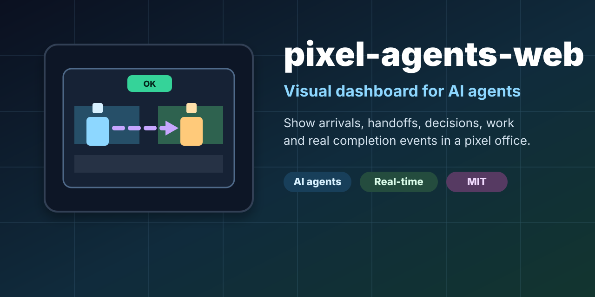

# pixel-agents-web

<p align="center">
  
</p>

<p align="center">
  <a href="https://github.com/Softradis/pixel-agents-web/actions"></a>
  <a href="./LICENSE"></a>
  <a href="./CONTRIBUTING.md"></a>
  <a href="https://github.com/Softradis/pixel-agents-web/discussions"></a>
</p>

**A visual dashboard for AI agents:** arrivals, ownership, handoffs, decisions, active work, and real completion events shown inside a small pixel-art office.

Instead of watching logs and guessing what an agent is doing, pixel-agents-web makes the workflow visible: a message arrives, an agent moves to it, work is assigned, a handoff can happen, a human decision may be needed, and the task only turns OK after a real completion event.

> Live demo: coming soon. For now, run it locally in under a minute.

## Why this exists

AI assistants and automations often feel invisible. They receive events, classify tasks, hand work off, wait for humans, and send replies, but most systems only expose that as logs.

pixel-agents-web explores a more readable metaphor: a tiny office where agent work becomes visible at a glance.

## Use cases

- Real-time AI agent workflow visualization.
- Internal assistant dashboards.
- Human-in-the-loop automation monitoring.
- Event-driven task ownership and handoff demos.
- Visual status layer for OpenClaw, webhooks, queues, or custom agents.

## Features

- React + Vite canvas-based pixel office.
- Real event ingestion through `/api/events` using Server-Sent Events.
- Editable office layout: furniture, agent positions, work anchors, and orientation arrows.
- Visual work states for configurable agents:
  - walk to the message arrival point,
  - move to the configured work point,
  - face the configured direction,
  - show typing/activity while waiting,
  - show OK only after a real `whatsapp.reply_sent` event.
- Debug tracing for event boundaries: SSE, mapping, tasks, agents, and rendering.

## Quick start

```bash
npm install
npm run dev
```

Then open the URL printed by Vite, usually:

```text
http://localhost:5173/
```

Build:

```bash
npm run build
```

Run the small static/SSE server after building:

```bash
PORT=8080 node server.js
# open http://localhost:8080/
```

## Event API

Start the app with `PORT=8080 node server.js` and POST events to `/api/events`:

```bash
curl -X POST http://localhost:8080/api/events \
  -H 'Content-Type: application/json' \
  --data '{"type":"whatsapp.received","id":1,"text":"hello","target":"vera"}'
```

Mark the task as really completed:

```bash
curl -X POST http://localhost:8080/api/events \
  -H 'Content-Type: application/json' \
  --data '{"type":"whatsapp.reply_sent","id":1}'
```

Useful event types:

- `whatsapp.received` — creates an incoming message flow. Use `target: "vera"` or `target: "cris"` in the current demo.
- `assigned_to_vera` / `task.assigned_to_vera` — starts a flow assigned to the first demo agent.
- `assigned_to_cris` / `task.assigned_to_cris` — starts a flow assigned to the second demo agent.
- `whatsapp.reply_sent` — marks the current task as really completed/OK.

## Docker

```bash
docker compose -f deploy/example/docker-compose.yml up -d --build
```

The example compose file maps the app to:

```text
http://localhost:8080/
```

## Layout editor

Open the app and use **Editor elementos** to edit:

- furniture and decorative elements,
- agent starting positions,
- PC assignment for the demo agents,
- work anchors:
  - `Llega mensaje`,
  - `Leer/teclear WA`,
  - `Trabajo agente A`,
  - `Trabajo agente B`,
  - `Entrega agente A→B`,
  - `Decisiones`,
- orientation arrows for each work anchor.

Use **Copiar layout** to export the current `elements`, `anchors`, and `anchorDirections` JSON.

## Roadmap ideas

- Hosted demo.
- README GIF/video of the workflow.
- Import/export for layout JSON.
- More event adapters: OpenClaw, GitHub issues, queues, n8n, generic webhooks.
- Tests for event-to-task state transitions.
- More configurable agent names and sprites.

## Promotion kit

If you want to share the project, see [`docs/promo/LAUNCH_KIT.md`](./docs/promo/LAUNCH_KIT.md) for:

- GitHub description and topics,
- post drafts,
- places to share,
- social preview guidance.

## Community & Contributing

Use [Issues](https://github.com/Softradis/pixel-agents-web/issues) to report bugs or request new features. For open questions, design ideas, implementation tradeoffs, and general conversation, join [Discussions](https://github.com/Softradis/pixel-agents-web/discussions).

See [`CONTRIBUTING.md`](./CONTRIBUTING.md) for instructions on how to contribute, open useful bug reports, propose features, and submit pull requests.

Please read our [`Code of Conduct`](./CODE_OF_CONDUCT.md) before participating.

## Supporting the Project

If you find Pixel Agents Web useful, consider supporting its development:

[](https://github.com/sponsors/Softradis)
[](https://www.patreon.com/empresarioMadri)
[](https://ko-fi.com/softradis)

## Credits

This project uses and adapts pixel-art ideas/assets inspired by Pixel Agents:

- [`pablodelucca/pixel-agents`](https://github.com/pablodelucca/pixel-agents)

Thank you to the original author for making that work available.

Additional local assets may include generated or hand-edited sprites and furniture used for this prototype. See [`docs/ASSETS.md`](./docs/ASSETS.md).

## License

MIT. See [`LICENSE`](./LICENSE).
